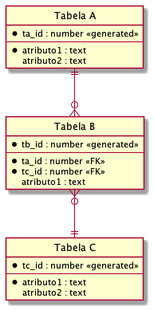
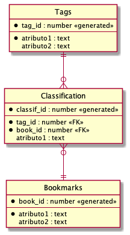
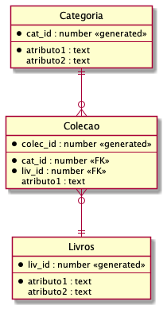

# AS - Programação Aplicada 2 

Individual

---
## Descrição

Esse é um trabalho sobre Banco de Dados com Python e Flask. 

A figura abaixo representa um esquema geral de tabelas de um banco de dados relacional conhecido como relacionamento N:N. A tabela do meio (B), relaciona as duas outras (A e C), de forma que um item da tabela A pode se relacionar com vários itens da tabela C e vice-versa. Repare que a Tabela B tem os id's das outras duas tabelas como chaves estrangeiras (FKs).

---
Por exemplo, poderíamos usar esse esquema para modelar um mecanismo de __Bookmarks__ (urls da web que desejamos salvar para consulta futura) da seguinte forma:

Onde: 
    - Tabela __Tags__: rótulos que são usados para classificar bookmarks (basicamente, só precisa de um nome)
    - Tabela __Classification__: relaciona Tags e Bookmarks de forma que um bookmark pode ter várias tags e uma tag pode classificar vários bookmarks. 
    - Tabela __Bookmarks__: os bookmarks em si (precisa no mínimo de um campo para a url e outro para uma breve descrição)

---
Outro exemplo do mesmo esquema. Você pode cadastrar livros e organizá-los em categorias, constituindo uma coleção. Veja:

Onde: 
    - Tabela __Categoria__: indicam categorias para organizar os livros (basicamente, só precisa de um nome)
    - Tabela __Coleção__: relaciona Categorias e Livros. Um livro pode estar em várias categorias e uma categoria pode ter vários livros. 
    - Tabela __Livros__: os livros em si (podemos guardar o título, a lista de autores, um estado indicando se já foi lido ou não, por exemplo)

---
## Tarefa

### Banco de Dados
- Escolha uma implementação baseada nesse esquema (uma das sugeridas acima ou crie outra usando a mesma estrutura).
  - Você deve informar qual modelo escolheu, preenchendo [a planilha que criei no Google Drive](https://docs.google.com/spreadsheets/d/1VDnggWooUtTzBcYgm8RwpPAQgEfz5i8ynzhUQuAz53M/edit?usp=sharing).
  - Preencha a planilha, na linha correspondente ao seu nome, na coluna `Tema` indicando o modelo escolhido com o seguinte formato: `Tabela A-->Tabela B<--Tabela C`
  - Exemplos: 
    - Categorias-->Coleção<--Livros
    - Tags-->Classification<--Bookmarks
    - Categorias-->Catálogo<--Produtos
    - etc
  - O mesmo tema só pode ser escolhido por até 2 alunos. Caso já tenha duas linhas com o mesmo tema preenchido na planilha, você deve escolher outro. 

- Você deve criar o modelo escolhido em um banco de dados Postgres no __ElephantSQL__:
  - Crie um arquivo `create.sql` com os comandos que fazem a criação das tabelas.
  - Crie um arquivo `insert.sql` com os comandos que inserem dados iniciais nas tabelas para teste do seu modelo. 

### Aplicação Flask

Vou explicar como deve ser o funcionamento usando o modelo Categorias-->Coleção<--Livros. Adapte para o seu caso. 

Você deve criar uma aplicação Flask onde o usuário deve informar a categoria desejada em um formulário HTML. A aplicação então consulta no banco de dados todos os livros daquela categoria e os apresenta em uma tabela HTML como resultado. Você deve escolher que informações de um livro vai apresentar na tabela resultante.

#### Características

- Sua aplicação deve implementar __obrigatoriamente__ duas rotas:
    1. __Home__: deve exibir um formulário HTML para que o usuário informe a categoria que deseja consultar. 
    2. __Resultado__: deve apresentar uma tabela HTML com os dados dos livros da categoria solicitada. 

## Entrega

- O código deve ser entregue via Replit. Faça upload dos arquivos `create.sql` e `insert.sql` também. Basta dar o Submit quando finalizar. 

- Você deve entregar um vídeo de até 8 min, apresentando o que faz sua aplicação e explicando as principais soluções no código. Primeiro mostre o site funcionando, depois explique o código. O vídeo deve ser entregue pelo link apropriado disponível no eClass. 

## Bônus

- O item i da seção __Características__ acima, pode ser implementado com um `<input type="text">`, mas vale ponto extra se você conseguir usar um `<select>`. Nesse caso, na função `index` do python você deve obter a lista de categorias do banco de dados e enviá-la para o `index.html` pelo `render_template`. Recomendo ter uma versão pronta usando `<input>` e tentar essa variação, se tiver tempo. 

- Se você usar algum template CSS para estilizar suas páginas (Bootstrap ou qualquer outro. Pode reutilizar os templates usados em outros projetos no curso)